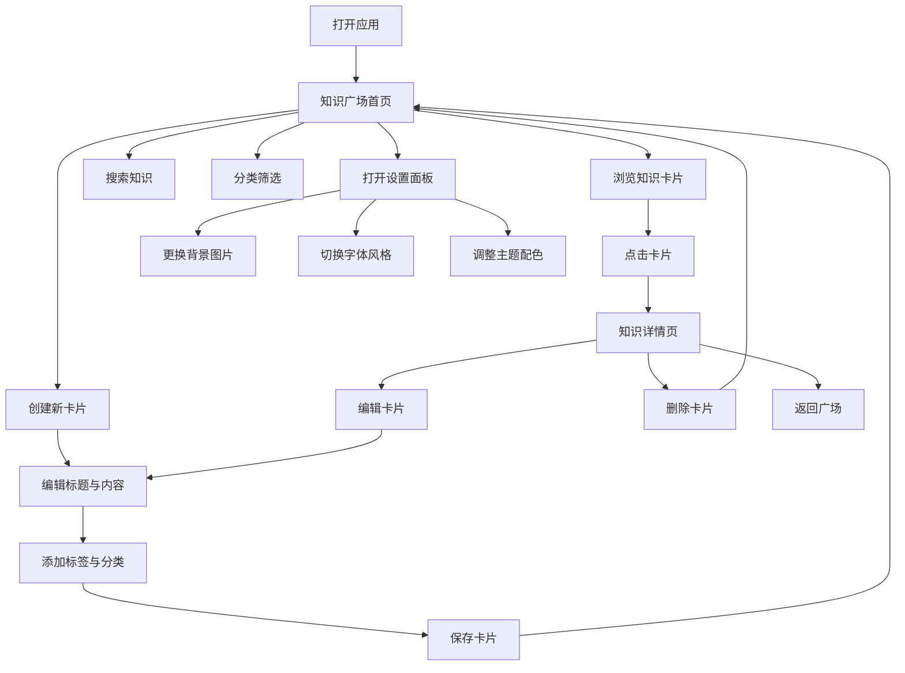

## 1. 产品概述

「星穹智识」(StarVault) 是一款轻量级本地知识收藏与管理工具。它以二次元/动漫游戏风格的视觉设计为特色，帮助用户收集、整理和检索各种信息碎片与知识卡片。目标用户是喜欢动漫、二次元文化的知识收集爱好者。

- 核心问题：解决个人知识碎片散落各处、难以统一管理和回顾的问题
- 产品定位：一款兼具实用性与审美价值的个人知识库工具，让知识管理变成一种享受

## 2. 核心功能

### 2.1 用户角色

| 角色 | 说明 | 核心权限 |
|------|------|----------|
| 普通用户 | 本地使用，无需注册 | 全部功能（创建、编辑、删除、搜索、导出知识卡片） |

### 2.2 功能模块

1. **知识广场（首页）**：展示所有知识卡片，支持网格/列表视图切换，提供搜索和分类筛选
2. **卡片编辑器**：创建和编辑知识卡片，支持标题、内容、标签、分类、Markdown 格式
3. **设置面板**：自定义背景图片、切换字体风格、主题颜色调整
4. **知识详情**：查看单张卡片的完整内容，支持全屏阅读模式

### 2.3 页面详情

| 页面名称 | 模块名称 | 功能描述 |
|----------|----------|----------|
| 知识广场 | 顶部导航栏 | Logo、搜索框、视图切换按钮、设置入口 |
| 知识广场 | 分类标签栏 | 水平滚动的分类/标签筛选，点击切换分类 |
| 知识广场 | 卡片网格 | 以卡片形式展示知识条目，悬停有动画效果，点击进入详情 |
| 知识广场 | 浮动创建按钮 | 右下角悬浮的 "+" 按钮，点击打开编辑器 |
| 卡片编辑器 | 编辑表单 | 标题输入、Markdown 内容编辑、标签管理、分类选择 |
| 卡片编辑器 | 预览面板 | 实时预览 Markdown 渲染效果 |
| 设置面板 | 背景设置 | 上传自定义背景图片、选择预设背景 |
| 设置面板 | 字体设置 | 从预设字体列表中选择显示字体，实时预览 |
| 设置面板 | 主题设置 | 切换主题色调（多种预设配色方案） |
| 知识详情 | 内容展示 | Markdown 渲染的完整知识内容 |
| 知识详情 | 操作栏 | 编辑、删除、返回按钮 |

## 3. 核心流程

用户打开应用后，进入知识广场首页，可以看到所有已收藏的知识卡片。用户可以通过顶部的搜索框搜索特定知识，或通过分类标签筛选。点击右下角的浮动按钮创建新卡片，进入编辑器填写标题、内容和标签后保存。点击任意卡片进入详情页查看完整内容，可在此编辑或删除。通过设置面板可自定义背景图片、字体风格和主题颜色。

## 4. 用户界面设计

### 4.1 设计风格

- **整体风格**：赛博朋克 × 和风美学融合，灵感来源于《女神异闻录5》《原神》《崩坏：星穹铁道》等游戏的 UI 设计语言
- **主色调**：深色基底 (#0f0f1a 深紫黑) 搭配霓虹青色 (#00f0ff) 和品红色 (#ff2d95) 作为强调色
- **辅助色**：琥珀金 (#ffb347) 用于高亮和特殊标记，柔和紫 (#7c3aed) 用于次要元素
- **按钮风格**：带有微妙发光效果 (neon glow) 的斜切角按钮，悬停时有光晕扩散动画
- **字体**：预设多种独特字体供切换 —— 包括手写风格、像素风格、日系ゴシック风格等，拒绝使用 Arial/Inter 等常见字体
- **布局风格**：卡片网格布局，支持不规则交错排列的"画廊"模式
- **图标**：使用 Lucide 图标库，配合自定义的发光滤镜效果
- **动效**：粒子背景动画、卡片悬停浮起效果、页面切换的过渡动画、霓虹光晕呼吸效果
- **背景**：支持用户上传自定义背景图片，叠加半透明暗色遮罩和粒子特效，营造深度感

### 4.2 页面设计概述

| 页面名称 | 模块名称 | UI 元素 |
|----------|----------|---------|
| 知识广场 | 顶部导航栏 | 半透明毛玻璃效果，左侧 Logo + 搜索框居中，右侧设置齿轮图标 |
| 知识广场 | 分类标签栏 | 水平可滚动胶囊标签，选中状态有霓虹发光边框 |
| 知识广场 | 卡片网格 | 斜切角卡片设计，半透明深色背景，悬停上浮 + 边缘发光，显示标题、摘要、标签、日期 |
| 知识广场 | 浮动创建按钮 | 菱形/六边形按钮，品红色霓虹发光，旋转脉冲动画 |
| 卡片编辑器 | 编辑表单 | 磨砂玻璃面板，斜切角输入框，Markdown 工具栏 |
| 设置面板 | 各设置项 | 从右侧滑入的抽屉面板，分类清晰的设置选项 |
| 知识详情 | 内容展示 | 中央阅读面板，Markdown 排版，顶部渐变装饰线 |

### 4.3 响应式设计

- 桌面端优先设计（1920×1080 基准）
- 平板端（768px-1024px）：卡片网格缩为 2 列
- 手机端（<768px）：单列布局，底部导航栏替代顶部导航
- 所有交互元素支持触控操作

## 5. 数据存储

- 使用浏览器 localStorage 进行本地数据持久化
- 知识卡片数据结构包含：id、标题、内容(Markdown)、标签、分类、创建时间、更新时间
- 用户设置数据结构包含：背景图片(base64)、字体选择、主题配色
- 支持导出/导入 JSON 格式的数据备份