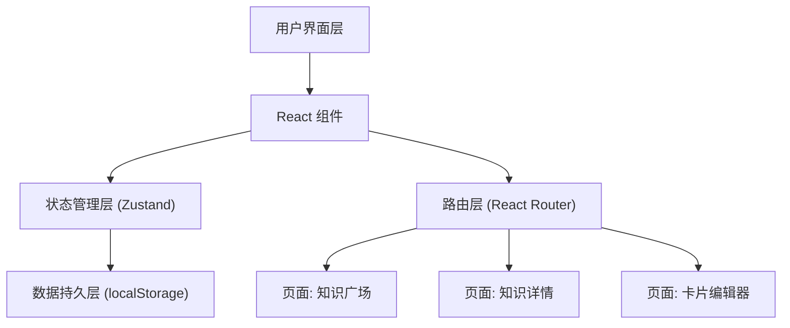

## 1. 架构设计

本项目为纯前端单页应用 (SPA)，无需后端服务，数据通过浏览器 localStorage 持久化。



## 2. 技术选型

| 层级 | 技术 | 版本 | 说明 |
|------|------|------|------|
| 前端框架 | React | 18 | 组件化 UI 开发 |
| 类型系统 | TypeScript | 5 | 类型安全 |
| 构建工具 | Vite | 5 | 快速开发与构建 |
| CSS 框架 | Tailwind CSS | 3 | 原子化样式，自定义主题 |
| 状态管理 | Zustand | 4 | 轻量级状态管理 + localStorage 中间件 |
| 路由 | React Router DOM | 6 | SPA 路由管理 |
| Markdown | react-markdown + remark-gfm | - | Markdown 渲染与 GFM 支持 |
| 图标 | lucide-react | - | 统一图标库 |
| 动画 | CSS Animations + framer-motion | - | 过渡动画与粒子效果 |

- **初始化工具**：vite-init
- **后端**：无（纯前端应用）
- **数据库**：浏览器 localStorage（通过 Zustand persist 中间件）

## 3. 路由定义

| 路由 | 页面组件 | 说明 |
|------|----------|------|
| / | KnowledgeSquare | 知识广场首页，展示所有知识卡片 |
| /detail/:id | KnowledgeDetail | 知识卡片详情页 |
| /editor | CardEditor | 新建知识卡片 |
| /editor/:id | CardEditor | 编辑已有知识卡片 |

## 4. 组件树

```
App
├── ParticleBackground        # 粒子背景动画
├── Navbar                    # 顶部导航栏
│   ├── Logo
│   ├── SearchBar
│   ├── ViewToggle
│   └── SettingsButton
├── Routes
│   ├── KnowledgeSquare       # 首页
│   │   ├── CategoryBar       # 分类标签栏
│   │   ├── KnowledgeGrid     # 卡片网格
│   │   │   └── KnowledgeCard # 单张知识卡片
│   │   ├── FloatingButton    # 浮动创建按钮
│   │   └── EmptyState        # 空状态提示
│   ├── KnowledgeDetail       # 详情页
│   │   ├── DetailHeader
│   │   ├── MarkdownViewer
│   │   └── ActionBar
│   ├── CardEditor            # 编辑器
│   │   ├── EditorForm
│   │   │   ├── TitleInput
│   │   │   ├── TagInput
│   │   │   └── MarkdownEditor
│   │   └── PreviewPanel
│   └── Settings              # 设置抽屉
│       ├── BackgroundSettings
│       ├── FontSettings
│       └── ThemeSettings
```

## 5. 数据模型

### 5.1 知识卡片 (KnowledgeCard)

```typescript
interface KnowledgeCard {
  id: string;
  title: string;
  content: string;        // Markdown 格式
  tags: string[];
  category: string;
  createdAt: string;       // ISO 日期字符串
  updatedAt: string;       // ISO 日期字符串
}
```

### 5.2 用户设置 (UserSettings)

```typescript
interface UserSettings {
  backgroundImage: string | null;  // base64 图片数据
  backgroundOpacity: number;       // 背景遮罩透明度 0-1
  fontFamily: string;              // 字体名称
  themeColor: string;              // 主题配色方案标识
  viewMode: 'grid' | 'list';       // 视图模式
}
```

### 5.3 应用状态 (AppStore)

```typescript
interface AppStore {
  cards: KnowledgeCard[];
  settings: UserSettings;
  isSettingsOpen: boolean;
  searchQuery: string;
  activeCategory: string;
  // Actions
  addCard: (card: Omit<KnowledgeCard, 'id' | 'createdAt' | 'updatedAt'>) => void;
  updateCard: (id: string, card: Partial<KnowledgeCard>) => void;
  deleteCard: (id: string) => void;
  updateSettings: (settings: Partial<UserSettings>) => void;
  setSearchQuery: (query: string) => void;
  setActiveCategory: (category: string) => void;
  toggleSettings: () => void;
  exportData: () => string;
  importData: (json: string) => void;
}
```

## 6. 预设字体列表

| 字体名称 | CSS font-family | 风格描述 |
|----------|----------------|----------|
| 星穹默认 | 'Noto Sans SC', sans-serif | 现代简约日系风格 |
| 像素物语 | 'Press Start 2P', monospace | 复古像素游戏风格 |
| 墨韵手书 | 'ZCOOL XiaoWei', serif | 中文手写韵味 |
| 樱花细体 | 'M PLUS Rounded 1c', sans-serif | 圆体日系可爱风 |
| 刀锋锐体 | 'Rajdhani', sans-serif | 赛博朋克科技感 |

## 7. 预设主题配色

| 主题名称 | 主色 | 强调色 | 描述 |
|----------|------|--------|------|
| 星穹暗夜 | #0f0f1a 底 / #00f0ff 强调 | #ff2d95 | 默认赛博朋克风格 |
| 樱花落 | #1a0a1a 底 / #ff6b9d 强调 | #ffb347 | 柔和粉色主题 |
| 极光森林 | #0a1a0f 底 / #00ff88 强调 | #7c3aed | 自然绿色主题 |
| 黄昏幻境 | #1a0f0a 底 / #ff8c00 强调 | #ff2d95 | 温暖橙色主题 |